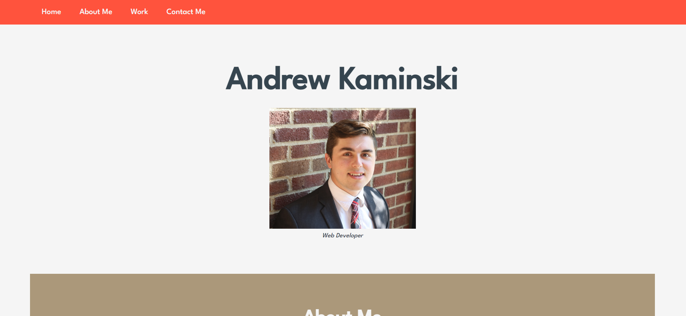

# Andrew-Kaminski-Portfolio

## Description

This is a landing page for me, Andrew Kaminski, to display and share my work.

As an aspiring web developer, I want to have a place where I can display my work in a creative way to people I care about.
This is also a place that potential employers can review my work which can be a real benefit in a job hunt.

The website landing page I have created is a great start to display information about myself, projects I'm working on/ will work on, etc.

I know now that there is much more I will need to do to make this site shine. I want to add new pages to display different kinds of projects
and add in my updated Resume.

## Table of Contents (Optional)

If your README is long, add a table of contents to make it easy for users to find what they need.

- [Installation](#installation)
- [Usage](#usage)
- [Credits](#credits)
- [License](#license)

## Installation

To install this project, download the files from my repository at https://github.com/AndrewKamSki/Andrew-Kaminski-Portfolio. From there you can load in the html file in your favorite IDE along with the corresponding CSS files. To see what the file looks like in a browser, open the index.html file in your browser.

## Usage

The deployed site can be viewed at: https://andrewkamski.github.io/Andrew-Kaminski-Portfolio/

The navigation bar at the top features interactive links that will change color when hovered over and scroll down to the corresponding sections of the page.

In the 'Work' Section, you can click on the links or text for projects to either be taken to their deployed webpage, or download the file associated.
The download for the AEV file is a pdf and the one for the QB Analysis is an excel file.

The 'Contact Me' Section includes interactive links to my GitHub and LinkedIn, with similar styling to the navbar links from earlier.

The website is also made to be mobile friendly, so you can access it via a cellphone or tablet. The screen layout will alter once the screen's maximum width is below 768px.
The navbar will elongate and the pictures and content will stack nicely on top of each other.

Here's a screenshot of the landing page!

## Credits

I was able to implement a unique font style in my code thanks to Google fonts. A link to their website is listed below:
https://fonts.googleapis.com/css2?family=League+Spartan:wght@500&display=swap

## License

MIT License

Copyright (c) [2022] [Andrew Kaminski]

Permission is hereby granted, free of charge, to any person obtaining a copy
of this software and associated documentation files (the "Software"), to deal
in the Software without restriction, including without limitation the rights
to use, copy, modify, merge, publish, distribute, sublicense, and/or sell
copies of the Software, and to permit persons to whom the Software is
furnished to do so, subject to the following conditions:

The above copyright notice and this permission notice shall be included in all
copies or substantial portions of the Software.

THE SOFTWARE IS PROVIDED "AS IS", WITHOUT WARRANTY OF ANY KIND, EXPRESS OR
IMPLIED, INCLUDING BUT NOT LIMITED TO THE WARRANTIES OF MERCHANTABILITY,
FITNESS FOR A PARTICULAR PURPOSE AND NONINFRINGEMENT. IN NO EVENT SHALL THE
AUTHORS OR COPYRIGHT HOLDERS BE LIABLE FOR ANY CLAIM, DAMAGES OR OTHER
LIABILITY, WHETHER IN AN ACTION OF CONTRACT, TORT OR OTHERWISE, ARISING FROM,
OUT OF OR IN CONNECTION WITH THE SOFTWARE OR THE USE OR OTHER DEALINGS IN THE
SOFTWARE.

## Future Changes

The application of this portfolio is only in its beginning stages. I'm currently working through my coding bootcamp course 
and will be learning many more things to help refine my code, but also add to make this website "POP".

I want to add on the next few projects we work on and some of my own if time permits. 

I'm also planning on having this page link to other HTML pages, projects, a link to my resume, and other features I haven't even a clue about yet.